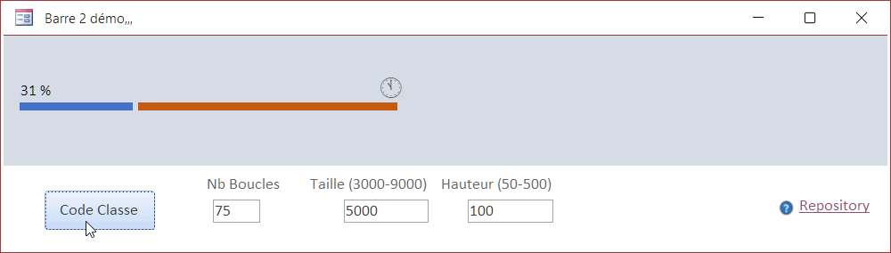

# MsAccess-ProgressBar 2

v 1.0 Petite démo de barre de progréssion.

# Formulaire F_Barre2Demo

# Utilisation :

- Ouvrir le formulaire `F_Barre2Demo`

## Important :

- Pour un positionnement correct des labels, suivre les indications ci-dessous
    - L'emplacement du label de texte (`lbl_M2Texte`) définira la positions des autres labels (a partir de sont coin bas/droite).

    - le lable1 (`lbl_BarreDeb`) doit avoir le point d'encrage horizontal(HorizontalAnchor) défini sur 'DROITE'
    - le lable1 (`lbl_BarreFin`) doit avoir le point d'encrage horizontal(HorizontalAnchor) défini sur 'GAUCHE'
    - Les 2 labels doivent avoir leurs point d'encrage vertical(VerticalAnchor) défini sur 'HAUT'
- Dans le cas contraire les labels ne se potionnerons pas correctement.

## Résumé

|   Créer le|   2022/09/04|
| - | - |
|   Auteur| [@meuslau](https://github.com/meuslaur)|
|   Catégorie|   MsAccess|
|   Type|   Utilitaire|
|   Langage|   VBA|

### Code exporté avec l'outil de : [@joyfullservice](https://github.com/joyfullservice) - [msaccess-vcs-integration](https://github.com/joyfullservice/msaccess-vcs-integration)

- Créez une base vide et utilisez `msaccess-vcs-integration` pour réimporter le code.
